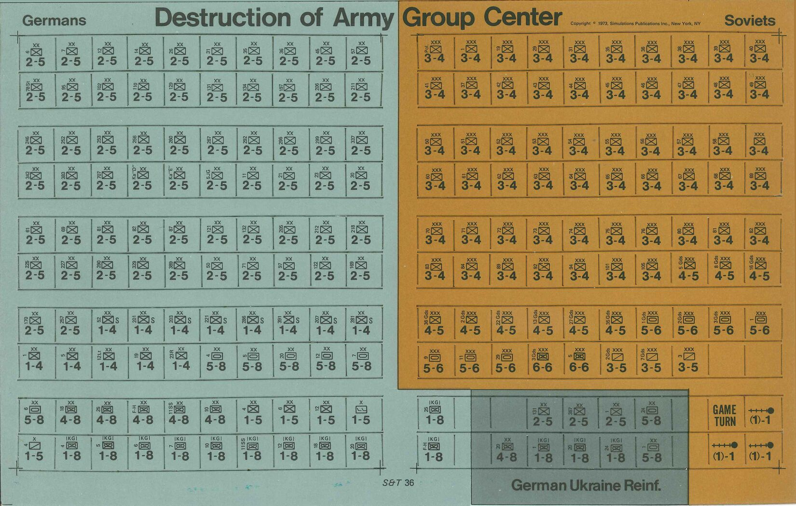
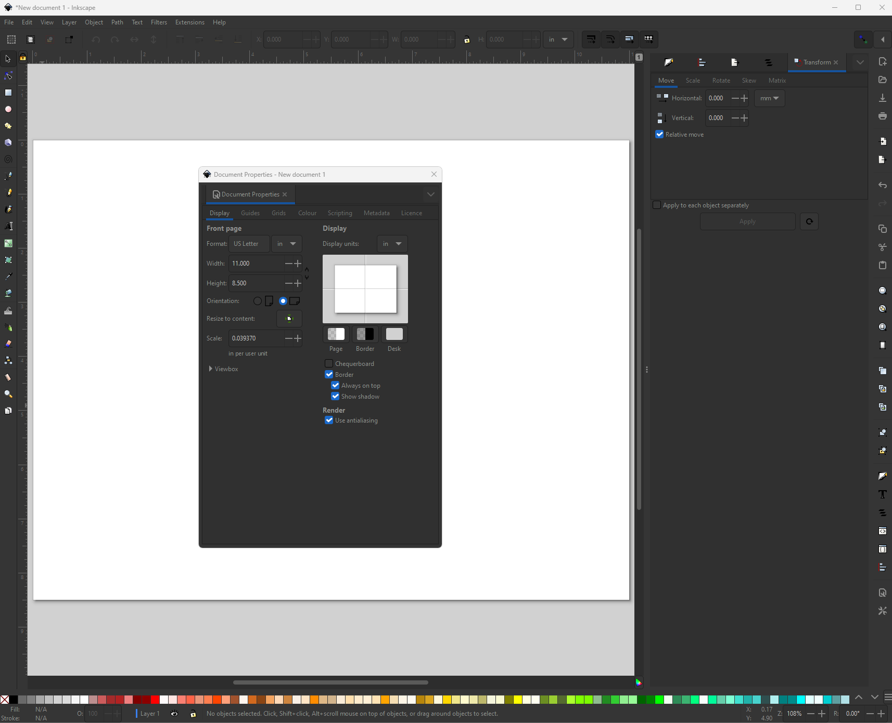

# Creating Wargames Counters with Inkscape

## SUMMARY

This short guide is intended to help gamers who want to begin counter creation with vector graphics ([SVG]) in [Inkscape]. The guide will explain how to start a counter sheet, create a basic counter, and make a sheet, based on the old SPI game *The Destruction of Army Group Center* ([Boardgamegeek](https://boardgamegeek.com/boardgame/8755/destruction-army-group-center-soviet-summer-offens))

The working files are available in the folder ```svgfiles``` for reference.

This is published on github at https://github.com/jzedwards/creating-wargames-counters-with-inkscape 

## INTRODUCTION

There are some good, simple online tools for counter creation, for example [snaphex], but this guide is intended to give you a basic starter in the free [Inkscape] app. [Inkscape] is the best value you can get, but it is not the most friendly of apps. If you have lots of cash, get Adobe [Illustrator] ; if you have some cash, consider [Affinity Designer]. It's worth reading a little of [SVG] basics (paths, fills, strokes, etc) before starting with [Inkscape]. The guide does not cover installing [Inkscape], [google] is your friend, or visit [this guide](https://wiki.inkscape.org/wiki/Installing_Inkscape).  
The guide will create a counter sheet page, add a counter, with text and symbols. Then copy the counters and create some background colours.

## CREATING A PAGE

What layout do you want? What size counters? I usually work to US formats and in inches, as most of my work is old wargames. For me, this means a US letter sized page, in landscape, which is 8.5x11 inches.  
My *target* sheet is *The Destruction of Army Group Center*


First, open [Inkscape]. It will open with document defaults (for me, A4, portrait). On the menu, choose ```File \ Document Properties```  



I have chosen US Letter, with inches (in) as the size format and the display units. Orientation is landscape.
**Scale** is interesting...

### SCALE: INCHES AND PIXELS

Interestingly, SVG does not really deal in real world scale; it works in pixels (px). However, [Inkscape] works to an *assumed* scale of 96 pixels per inch (ppi). This means that a 1/2" square counter is 48x48.
The ```Scale``` in the dialog box is 0.039370. What does that mean? It says it is *in per user unit*.  
1/0.039370=25.40005 - this is a clue. There are 25.4mm in an inch, so the *user unit* is mm, and one mm is 0.039370".  
This *user unit* can be used to work at different scales, but we will work to the defaults for now. We can look again at this scale when we save a page.

## GRIDS AND SNAPPING

```Grids``` are imho really useful, as counter layout is all about precise positioning. We want a reference ```Grid``` on our page. For a 1/2" counter, I recommend we have a 1/16" grid (8 boxes), and we will define a *major* grid line every 1/2", or every 8 *minor* lines. 1/16=0.0625  
We have also offset the grid by 1/4" (0.25) at the top corner

  

So, this is our page, we can see the 1/2" (major) grid.
We can reset the page to the screen with the key <kbd>5</kbd>, or zoom in with <kbd>+</kbd> and out with <kbd>-</kbd>


## CREATING A COUNTER

Let's do some damage. Our counters will be 1/2", so that will be one square of our grid.  
Click the ```Box``` icon on the left toolbar, to create a shape.  
Notice that the top right icon (white arrow) is clicked ```on``` - this is the ```Snap to Grid``` and will *snap* our object to the grid.  
Click and drag and you will create a square.  
Make it grey by clicking a colour at the bottom. More about colours later - I have chosen ```silver```.  
If you want to zoom into your new counter, you can press <kbd>3</kbd>.  


### FILL AND STROKE

To see info about the box and its colours, click the *Fill and Stroke* tab in the right toolbar. This will show you the colour (25% gray in the CMYK palette)
If your box was created with an outline, select the *Stroke paint* tab below and select the first ```X``` to remove the outline (this is the stroke).

**Fill and Stroke** is really important in [Inkscape] and [SVG]. Every Object (or ```Path```) is actually a series of lines joining points, so our counter is a square, starting at point 0,0 going to 48,0 (1/2" is 48px) then to 48,48, then 0,48 then closing at 0,0. As this box is a **closed** path, it has a ```Fill``` colour (silver). It can also have a ```Stroke``` width and colour, which would make an outline of the box. Below, I have made the stroke red and 3px.  
As you will see with more complex objects, a rectangle is just a special type of ```Path``` - pretty much everything in Inkscape/SVG is a path.  


## TEXT
What does a counter need? Information.
A clasic wargame counter typically has a size (eg XX for Divison, III for regiment), a unit designation and parent designation, a type symbol (usually NATO symbology) and some factors reflecting combat and movement capabilities.

Sample  


Click the left hand ```Text``` to add a text box, we are going to add the **size** attribute, which is an **XX** division symbol. We will choose the *sans serif* font as a default (more below) at 6pt (point).  


I tend to just copy a text object (select with the arrow on the left hand toolbar) and <kbd>CTRL C</kbd> ```Copy``` and <kbd>CTRL V</kbd> ```Paste```. Then position it.

Then double click in the text to change it, enter ```6``` and rotate 90 degrees left (see the yellow arrow) with the icon on the top toolbar. 
In the exanple, I have copied the text again and made it 10pt and changed to ```2-5```


## GROUPS

Right now, the background and the text are all individual objects. You might want to ```Group``` them to more easily copy and paste. 
Use the arrow icon, and drag around all of the items, then press <kbd>CTRL G</kbd>. They are now a group, and can be moved (or copied) together.  
The image below shows the group and the ```XML Editor``` details of the objects on the right (more later)


## SYMBOLS

Wargame counters usually use NATO symbols (or modified versions of them - see [wikipedia](https://en.wikipedia.org/wiki/NATO_Joint_Military_Symbology) or the full App6D spec is available at https://litpolukrbrig.wp.mil.pl/u/APP-6D_JOINT_MILITARY_SYMBOLOGY._16_October_2017.pdf).  
Firstly, we are going to create an infantry (INF) symbol.  
This will be based on a 3x2 box; so create a box like our grey one above, but this time it will not have a ```fill```, but will have a ```stroke```.  
Note: it is not in the final position yet.  


Click the ```Bezier Curves and Straight Lines``` pen icon to the left, and click in the bottom corner, then doublke click top corner for a straight line.  
Hurray! You have a cavalry symbol.  


Repeat for another line from the opposite corners and you have an infantry symbol!
Pick the ```Arrow``` selection tool, and click and drag the symbol, then <kbd>CTRL G</kbd> to group. Note - it's in the wrong place!


To move the symbol to the right spot will need to turnm **off** the snap to grid in the top left (see the white arrow)


## FONTS

Well that's not bad, but the text does not match the SPI original, and every symbol would need creating. That's hard work.  
Redmond A Simonsen's go to SPI font was Univers. It is available at https://www.cdnfonts.com/univers-lt-std.font and is highly recommended.  
If you prefer a free font, Google Roboto and Roboto Condensed is close.  
> https://fonts.google.com/specimen/Roboto  
https://fonts.google.com/specimen/Roboto+Condensed?query=roboto+condensed 

We can also be clever and use a font for NATO symbols. For much of my counter engineering life, the go to font was mapsymbs from Tom Mouat at http://www.mapsymbs.com/. This free font is brilliant, but is not up to date and does not work in [Inkscape]
PS Tom also has great vehicles and aircraft symbols, check them out.  

In the absence of a working NATO font, [simpubs] made one. It's available from   **github** at https://github.com/jzedwards/jzfonts and is called ```JZNATO.otf```. Download and install it.


### CHANGING THE COUNTER FONTS

#### TEXT FONTS

If you've installed Univers, you can change the counter to look more like the SPI original. Just select the text and change it.

Below we have used Univers LT Std, and made the ```size``` a condensed font (and increased the factors to 12pt).


#### SYMBOL FONTS

So, having installed JZNATO, delete the INF symbol, and add a new text object. My default is *sans-serif* font - type a 1. 


Now, change the font to *jznato**. As you can see above, the character ```1``` is the INF symbol in the font. Brilliant!  


Clearly, it is too small, and in the wrong place. Select it and change the font size.
Moving it to the image and comparing, 10pt is around the right size (note I have turned **off** snap).


## GUIDES

```Guides``` are, like the ```Grid```, a useful way to position objects. Counters are typically regic in setup, and using Guides and Grids are a useful way to manage content.

A guide is created by dragging from the ruler onto the page. I am aligning it with the centre of the symbol. I might be inclined to 'push' the graphics together in the centre; the original was an early 70s print, when accuracy was poor and the space left for die cutting was significant. I tend to keep 1/16 all round free of text. You will see the text and symbols are aligned with this in mind.


## COLOURS

Any colour you like. Within reason. SVG actually has a useful palette of **named colours**. These a great start, and make it easier to share files with others.
It is equally possible to specify any RGB (or CMYK) colour for an SVG object.

All of the SVG colours are available at the bottom of the [Inkscape] window.  
See https://inkscape-manuals.readthedocs.io/en/latest/palette.html

Below is a useful SVG *swatch*


The original is not grey, but is [Feldgrau](https://en.wikipedia.org/wiki/Feldgrau) (German field grey/green).  
As above, SVG colours are useful. I often use *darkseagreen* for Germany, as it is, to me, quite close to a *feldgrau*.  
One option available in [Inkscape] is the ```Eyedropper``` on the left toolbar. For illustration I created a small square and picked up the counter colour from the scan. As the interwebs say, #ymmv (*your mileage may vary*). make your choices and play with the colours.  


## LAYERS

Everything in [Inkscape] [SVG] is layered. Objects have a hierarchy, and sometimes your text or image will disappear under another.  
Objects can be moved up or down using the toolbar, or right click.  
The toolbar actions are - move to top/move up/move down/move to bottom


There is another ```Layer``` of complexity available; this actually puts a collection of objects onto a named Layer, which can be easily managed, selected, or locked (to stop editing) together. This is really helpful when we start to plan for e.g. backgrounds as we will do below.  

Layers are available on the menu with ```Objects \ Layers and Objects...``` which will open a panel to the rigt, or you can click the ```Layers``` panel if it is available.  


We have only one (default) layer called *Layer 1*. All of our objects are on this layer. The Layer tab also shows the hierarchy. If you have 'lost' an object, you can find it and move it up and down here. You will see we also have a group (```g15956```) which I have (confusingly) put all of our objects in. I will tidy this up in a moment, as we are adding a background.
I'm going to create a new layer. I called it **scratch**.


I moved my 'extras' to the scratch layer and locked it and made it invisible with the ```eye``` and the ```padlock``` to the right.


Now I will create a new **background** layer for my counter colour. Rather than have a colour for each counter, it is handy/easy to have a nice background for counters in a solid colour.


I have also made the counter 'box' transparent. This seems a bit odd, but it keeps the text exactly in the same place when I copy the counter, which makes it easier (honest). We now have a counter on one layer, a background, and a scratch layer.
A bit of copy and paste, and editing the unit designations, and we have the basis of a counter sheet.
Note I have used my favourite colour for the soviets, *goldenrod*.


The walkthru of the building of the sheet will stop here. I'll update with a 'final' sheet when I complete it.  

Note you can save your counter sheet at very high quality using the ```Export``` tab on the right, or ```File \ Export```

If you have found this useful, the next big step is creating counters from excel/csv data files. For this, see some of my sample files and Powerpoint in jzcounters on [Google Drive](https://drive.google.com/drive/folders/125Z7BwtiFRAb-buD6k4uR_afc7rn73pW?usp=drive_link) using the brilliant [Inkscape Counter Extension] on github from Pelle Nilsson.

## CROP MARKS

Finally, if you are doing this for print'n'play (PnP), it can be useful to have cut lines, or crop marks, for cutting out.  
I usually do this for my die cutter, and have different layers for die cut, crop marks, and grid.
The crop marks are 2 lines, at 90deg, in 50% grey, grouped together. I then copy and paste to build a 2x10 matrix for my 20 counters. The tutorial won't explain the detail. Try it out.


## XML EDITOR
**WARNING** - deep tech incoming

A little extra. If you are interested in the tech, we referenced the ```XML Editor``` earlier. Under the hood, all SVG is actually like a web **HTML** *markup* document. It is *not* an image, but a (mathematical) description of an image, with boxes, lines, curves and colours all saved in a text file (an SVG file).  
The XML editor shows what is 'under the covers'. Below is the XML Editor view for our sheet. It is opened up for one of the text fields on a counter, ```text8633-5``` (an automatic number generated with copy/paste)


The actual SVG code looks like this (it's more complex than it needs to be to support Inkscape, which is why it has style). The key stuff is the X/Y position, the **rotate** and the number **7**.

```XML
<text xml:space="preserve"
         style="font-style:normal;font-variant:normal;font-weight:bold;font-stretch:normal;font-size:2.11667px;line-height:1.98437px;font-family:Roboto;-inkscape-font-specification:'Roboto Bold';text-align:center;text-anchor:middle;fill:#c0c0c0;stroke:none;stroke-width:0.79375;stroke-dasharray:none;stroke-opacity:1"
         x="-12.012804"
         y="9.4897814"
         id="text8633-5"
         transform="rotate(-90)" >
    <tspan id="tspan8631-5"
           style="font-style:normal;font-variant:normal;font-weight:normal;font-stretch:normal;font-size:2.11667px;font-family:'Univers LT Std';-inkscape-font-specification:'Univers LT Std';fill:#000000;stroke-width:0.79375"
           x="-12.012804"
           y="9.4897814">7
    </tspan>
</text>
```

If you share this file with someone else and they don't have the fonts installed, they won't see the symbols, and the text will 'fall back' to a basic sans serif (not Univers). To work around this you can convert all the content to ```paths```. This means that a ```7``` isn't a character 7 any more, but an SVG drawing of a 7 (weird).
You can no longer easily text, so this is the LAST thing to do if you want to share an SVG.

## APPENDICES

### A. Quality & Formats

The core reference map and counter scans are 150ppi JPG/jpeg images, at 8/12 (roughly 80%) quality [see below for more on JPG ‘quality’]. pdf documents (rules, charts) are ideally at 300ppi (though many are 150ppi) with OCR [optical character recognition] so you can copy the text. Most are greyscale, but some are colour (which is bigger).

#### What the heck is ppi? Is it not dpi?

ppi is Pixels per Inch; it is a measure of scanned image quality. dpi is ‘dots per inch’ and a measure of inkjet printer quality. At simpubs, we love quality. The 150ppi reference scans are ok, but this pretty small for the info an image has, and can be pretty blurry zoomed in.

#### Pixels

A pixel is a dot on your screen (or in your image file), which has a colour value (amounts of red/green/blue, or RGB). A 1/2″ counter at 150ppi is 75×75 pixels (that’s not a lot of dots, 5625 to be exact). A 1/2″ counter at 600ppi is 300×300 or 90,000 dots (16 times better/bigger)

Interestingly, scanning at 600ppi will sometime show the printing dots and flaws inherent in 1970s print.

#### JP(E)G, TIF(F), PNG?

These are all image formats. Most images out there for general use are JPG, and it works well. JPG is very good at making images small, using compression, and as well as ppi has a ‘quality’ setting (usually 0-100 or 1-12). However, JPG compression (lower quality) is ‘lossy’ ie it throws data away and ‘guesses’ values between pixels. This makes an 80% JPG small, but a TIF or a PNG format can be compressed and keep all the data. To be honest, storage is pretty cheap – go big! Sometimes PNGs are easier to preview on web sites and on your computer, but they take a little longer to open and close when editing, so we will usually work with TIF (LZW compression, no layers) but share in PNG (hi) and JPG (lo). PS we generally dislike GIFs

#### What is SVG?

Scaleable Vector Graphics [SVG] is a type of image that can be scaled (bigger or smaller) with no loss in quality. In a vector file, the images are mathematical, and the image is generated based on the maths. Vector files were developed for web pages, but are widely used in images now. Most counters are a collection of shapes, text, numbers and symbols, which can be well defined in an SVG file.

### B. Copyleft

[simpubs] is free, and makes no income from the shared content. Where content is available publicly on a legitimate site (eg https://www.wargamevault.com), we do not republish this. Please go and buy it and support the creators. However, there are people charging for DVD/scans of SPI content. Please do not encourage them, especially if they are taking content from here and elsewhere and repackaging the work of others for personal profit.

Any original simpubs content (like this) is published under Creative Commons CC BY-SA-NC 4.0 international terms https://creativecommons.org/licenses/by-nc-sa/4.0. See our FAIR USE page for more info.

[snaphex]: https://snaphex.com/snap_counter
[Inkscape]: https://www.inkscape.org
[SVG]: https://www.w3schools.com/graphics/svg_intro.asp
[Illustrator]: https://www.adobe.com/products/illustrator
[Affinity Designer]: https://affinity.serif.com/designer
[simpubs]: https://www.simpubs.org
[google]: https://www.google.com
[Inkscape Counter Extension]: https://github.com/lifelike/countersheetsextension
